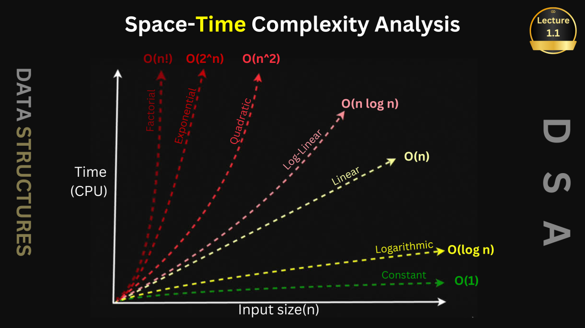

## **1. Time Complexity**

Time complexity measures **how the running time of an algorithm grows** with input size **n**.

### **Common Time Complexities**

* **O(1) – Constant time**
  Running time does not change with input size.
  Example: Accessing an element in an array.

* **O(log n) – Logarithmic time**
  Input size is reduced by half each step.
  Example: Binary Search.

* **O(n) – Linear time**
  Time grows directly with input size.
  Example: Loop through an array.

* **O(n log n)**
  Slightly slower than linear; common in good sorting algorithms.
  Example: Merge Sort, Quick Sort (average).

* **O(n²) – Quadratic time**
  Often seen in nested loops.
  Example: Bubble Sort, Selection Sort.

* **O(2ⁿ) – Exponential time**
  Very slow; time doubles for each extra input.
  Example: Solving subsets recursively.

* **O(n!) – Factorial time**
  Extremely slow; generates all permutations.
  Example: Brute-force Traveling Salesman Problem.

---

## **2. Space Complexity**

Space complexity measures **how much extra memory** an algorithm needs relative to input size **n**.

### **Common Types**

* **O(1) – Constant space**
  Uses fixed memory.
  Example: Swapping two variables.

* **O(n) – Linear space**
  Memory grows with input size.
  Example: Storing an array or list.

* **O(log n)**
  Seen in recursive algorithms that divide input.
  Example: Depth of recursion in Binary Search.

* **O(n²)**
  Used in matrix/grid-based problems.
  Example: Storing a 2D array.

---

## **Key Points**

* **Time complexity = speed of algorithm**
* **Space complexity = memory used**
* Big-O for **worst case** performance.
* Big-Theta (Θ) for **Average-case** performance. 
* Big-Omega (Ω) for **Best Case** performance
* Aim for **O(log n)** or **O(n)** when possible for optimal performance.

---

